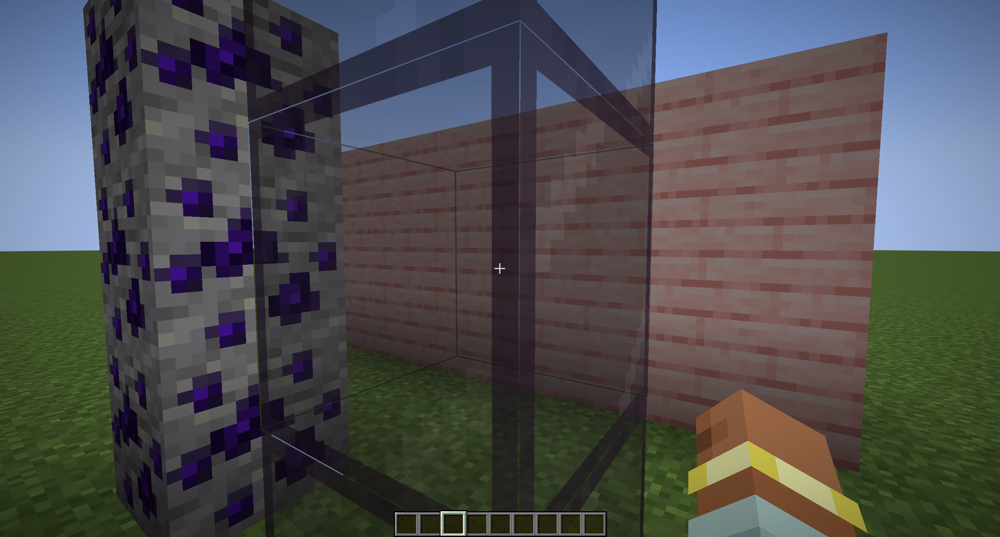
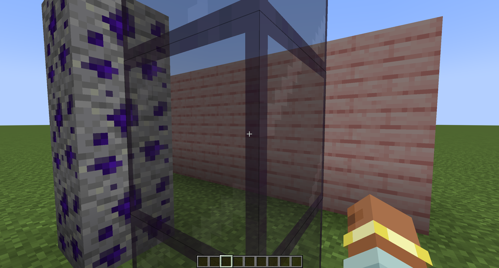
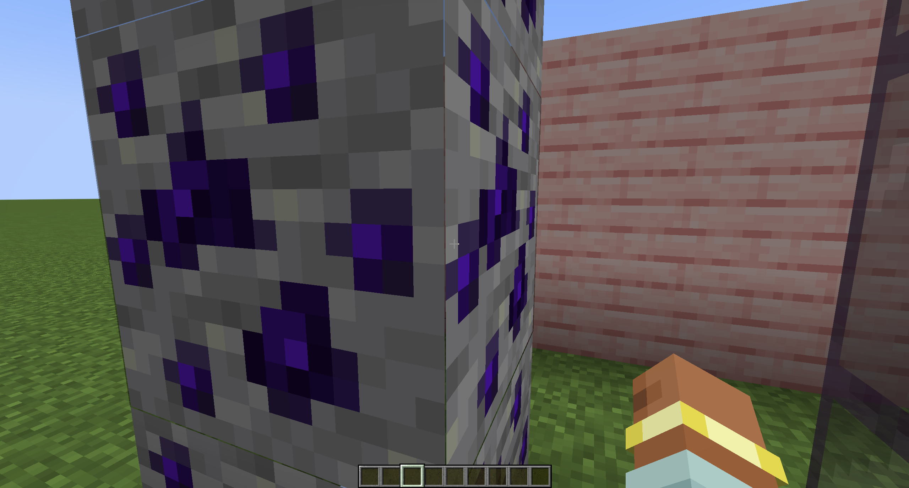
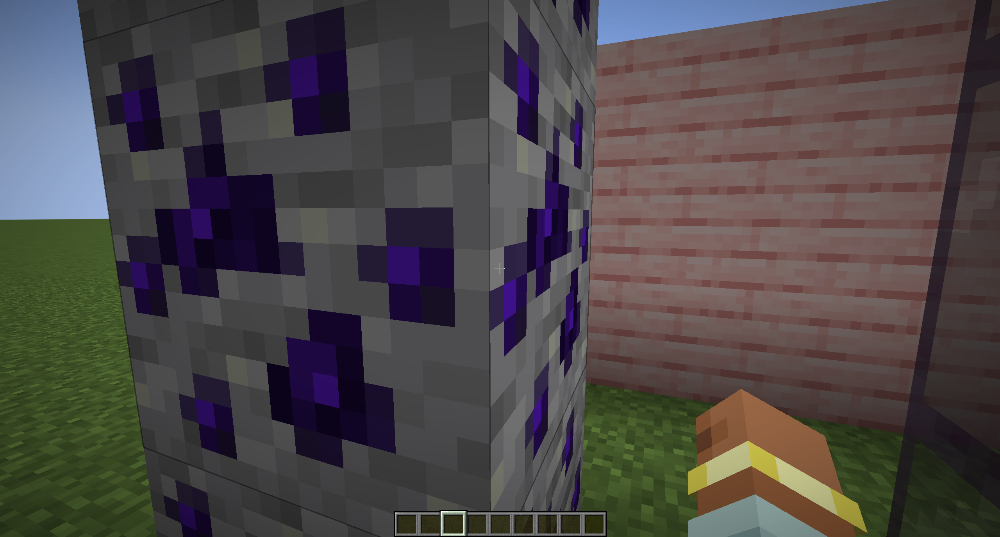
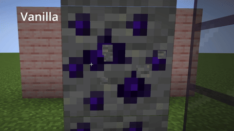

# Outline Fixer Minecraft

## Client side ONLY

<h3 style="color:#D3D3FF;">
- Fix outline transparency on `translucent` blocks. 
- Fix for destruction progress rendering on multi-layered `translucent` blocks
</h3>

# Outline fix

<h3 style="color:#D3D3FF;">

Glass (Vanilla translucent block)

|                       Vanilla (Before)                       |                    Outline Fixer (After)                    |
|:------------------------------------------------------------:|:-----------------------------------------------------------:|
|  |  |

 

Many layers translucent block

|                     Before                      |                     After                      |
|:-----------------------------------------------:|:----------------------------------------------:|
|  |  |

</h3>

# Crumbling fix

 

<h3 style="color:#D3D3FF;">

Break block effect (gif)

|                  Vanilla                  |                   With Mod                   |
|:-----------------------------------------:|:--------------------------------------------:|
|  |  |

</h3>

<h1 style="color:#D3D3FF;">

Compatibility

<h3 style="font-size:16px;">

| **Mod Name**    | **Status** | **Notes**                    |
|:----------------|:----------:|:-----------------------------|
| Embeddium       |     ✅      | -                            |
| Oculus          |     ⚠️     | **Broke `Crumbling` render** |
| ImmediatelyFast |     ✅      | -                            |
| Entity Culling  |     ✅      | -                            |
| Starlight       |     ✅      | -                            |
| Chloride        |     ✅      | -                            |
| ModernFix       |     ✅      | -                            |

</h3>

</h1>

